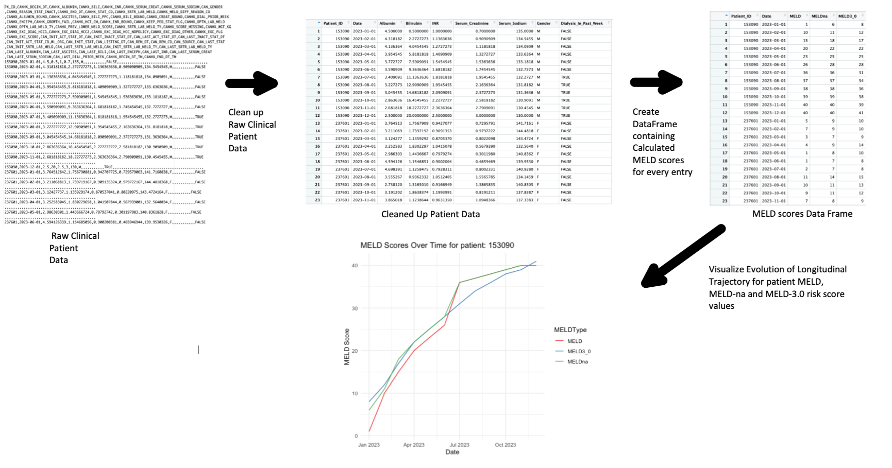

<!-- README.md is generated from README.Rmd. Please edit that file -->

```{r, include = FALSE}
knitr::opts_chunk$set(
  collapse = TRUE,
  comment = "#>",
  fig.path = "man/figures/README-",
  out.width = "100%"
)
```

# LivTransplantEvolution

<!-- badges: start -->
<!-- badges: end -->

## Description

End-Stage Liver Disease (ESLD) is a terminal diagnosis that encompasses advanced liver disease, liver failure, and decompensated cirrhosis. Liver transplantation, either from living or deceased donors, remains the only life saving therapeutic intervention available. Transplanted organs can be Living Donor Liver transplantation (LDLT) or Deceased Donor Liver transplantation (DDLT). DDLT is the major form of transplantation in Canada accounting for 78% of Liver Transplants (LT) in 2021. Various allocaiton systems exist but the main one is the Model for End-stage Liver Disease (MELD) 
score, a linear model that uses the log of the Serum Creatinine, International Normalized Ratio (INR) and Bilirubin. It is the the adopted method of severity calculation in the united states and Canada. 

The MELD score informs the 90 day mortality of that patient following this scheme:
MELD is ≤9 = 1.9% Mortality, MELD is 10–19 = 6.0% Mortality, MELD is 20–29 = 19.6% Mortality
MELD is 30–39 = 52.6% Mortality, MELD is ≥40 = 71.3% Mortality. 
MELD-na is an augmentation to the MELD score calculation that takes into account Serum Sodium as it was shown that taking sodium into account for the MELD score calculation would improve it somewhat. MELD 3.0 is an improvement on the MELD-na score that tries to compensate for equity issues identified 
with the MELD and MELD-na risk scores such as sex-based disparity against women. MELD 3.0 takes into account the the albumin biomarker and the gender of the patient.  

The Scientific Registry of Transplant Recipients (SRTR) database is the database 
containing information largely collected by the Organ Procurement and Transplantation Network (OPTN) in the United States. This very Large database contains the information for all patients who have been added to a transplant wait list in the United States.
Moreover the patient data within the SRTR database is the base for a great deal of the transplantation research going on in North America.

The goal of `LivTransplantEvolution` is to be an analysis tool for clinicians using the SRTR database and conducting research on Liver transplantation who might not have the greatest familiarity with technical analysis and computation. What it will do take the Raw Liver transplantation patient data from the stathiist_liin data file from the SRTR database. It will clean this data, to only keep the relevant biomarkers to calculate the various MELD scores. It will analyze the Liver transplantation relevant biomarkers, specifically those used in the MELD, MELD-na and MELD-3.0 risk score calculations (Creatinine, Bilirubin INR, Albumin & Sodium). It will visualize the trajectories of those risk scores, compare them and
  extract the biomarkers most impactful of each longitudinal change. These plotted trajectories and calculated MELD scores will help inform clinicans about the potential future patient state and the trajectory of the patient health journey. 
  
  - R Development Version: 4.1.2
  - Platform: x86_64-apple-darwin20 (64-bit)
  - Running under: macOS Monterey 12.0.1

## Installation

You can install the development version of LivTransplantEvolution from [GitHub](https://github.com/Mouaid-Alim/LivTransplantEvolution) with:

``` r
install.packages("devtools")
library("devtools")
devtools::install_github("Mouaid-Alim/LivTransplantEvolution", build_vignettes = TRUE)
library("LivTransplantEvolution")
```
To run the ShinyApp:
``` r
LivTransplantEvolution::runLivTransplantEvolution()
```

## Overview

``` r
ls("package:LivTransplantEvolution")
data(package = "LivTransplantEvolution") # optional
browseVignettes("LivTransplantEvolution")
```

`LivTransplantEvolution` contains 6 functions. 

`prepareData`: Takes in a csv file for the STATHIIST_LIIN data file from the SRTR
database, prepares and cleans up the raw patient data from the data file to
extract only the coloumns containing Liver transplantation relevant clinical 
serum biomarker data, specifically those used in the MELD, MELD-na and MELD 3.0
risk score calculations. The columns returned are Patient_ID, Date, ALbumin, 
Bilirubin, INR, Serum_Creatinine, Serum_Sodium, Gender and Dialysis_In_Past_Week

`calcMELD`: A function that calculates the MELD risk score given the input values
for Creatinine, Bilirubin, Inr and TRUE or FALSE for whether the patient has
had dialysis in the past week

`calcMELDna`: A function that calculates the MELD-na risk score given the input 
values for Creatinine, Bilirubin, Inr, Sodium and TRUE or FALSE for whether the 
patient has had dialysis in the past week

`calcMELDthree`: A function that calculates the MELD-3.0 risk score given the 
input values for Creatinine, Bilirubin, Inr, Sodium and 'F' or 'M' for the 
gender of the patient

`createMELDdf`: A function that that will take a dataframe containing the cleaned
up patient data generated by the prepareData function. It Will create a dataframe
from the cleaned up data that contains longitudinal MELD risk score values for 
MELD, MELD-na and MELD-3.0 for every entry adn every patient

`visualizeMELD`: A function that will take in the dataframe created by the 
createMELDdf function and visualize the longitudinal MELD score trajectories for
the MELD, MELD-na and MELD-3.0 risk scores together for every patient

### Package Workflow:



## Contributions
This Package is Created by Mouaid Alim.

The `prepareData` function uses the `reader` package to read the csv file and 
uses the `dplyr` package to create the final dataframe with correct column names.
The `createMELDdf` function uses the `dplyr` packaage to create the MELD 
dataframe, uses the `purr` package to efficciently calculate the MELD scores
for the dataframe, uses the `tidyr` package to clean up the input dataframe and 
uses the `devtools` package to import the LivTransplantEvolution package to be 
able to call the buil-in functions for calculating the various MELD scores. The 
`visualizeMELD` function uses the `tidyr` to reshape the
data for plotting and uses the `ggplot2` package for plotting the MELD visuals.
Formula used to calculate MELD score in `calcMELD` function adapted from paper by 
Kamath et al. Formula used to calculate MELD-na risk score in `calcMELDna` 
function adapted from paper by Biggins, S. W. et al. Formula used to calculate 
MELD-3.0 risk score in `calcMELDna` function adapted from 
paper by Kim, W. R. et al. The `TestingPackage` package was used as guide for
overall package structure. The `shiny` package was used to create the shiny 
app for this package. The `shinyalert` package was used in the creation of some
components of the shiny app as well.

## References

1.
Potosek, J., Curry, M., Buss, M. & Chittenden, E. Integration of palliative care
in end-stage liver disease and liver transplantation.
*J. Palliat. Med.* 17, 1271–1277 (2014).
2.
Summary statistics on organ transplants, wait-lists and donors. Cihi.ca https://www.cihi.ca/en/summary-statistics-on-organ-transplants-wait-lists-and-donors.
3.
Kwong, A. J. et al. OPTN/SRTR 2019 annual data report: Liver. *Am. J. Transplant*
    21 Suppl 2, 208–315 (2021).
4.
Liver transplant risk stratification. R-project.org         https://cran.r-project.org/web/packages/transplantr/vignettes/liver_recipient_scoring.html.
5.
The SRTR database.
    Srtr.org https://www.srtr.org/about-the-data/the-srtr-database/.
6.
Kamath, P. et al. A model to predict survival in patients with end-stage
    liver disease. *Gastroenterology* 120, A76–A77 (2001).
7.
Kim, W. R. et al. MELD 3.0: The model for end-Stage Liver Disease updated for
     the modern era. *Gastroenterology* 161, 1887-1895.e4 (2021).
8.
Slack, A., Yeoman, A. & Wendon, J. Renal dysfunction in chronic liver
    disease. *Crit. Care* 14, 214 (2010).
10.
Biggins, S. W. et al. Serum sodium predicts mortality in patients listed for
    liver transplantation. *Hepatology* 41, 32–39 (2005).
11.
Guerra Ruiz, A. R. et al. Measurement and clinical usefulness of bilirubin in
     liver disease. *Adv. Lab. Med.* 2, 352–361 (2021).
12.
Kalas, M. A., Chavez, L., Leon, M., Taweesedt, P. T. & Surani, S. Abnormal
    liver enzymes: A review for clinicians. *World J. Hepatol.*
    13, 1688–1698 (2021).
13.
Tufoni, M., Zaccherini, G., Caraceni, P. & Bernardi, M. Albumin: Indications
    in chronic liver disease. *United European Gastroenterol. J.*
    8, 528–535 (2020).
14.
Wickham H, François R, Henry L, Müller K, Vaughan D (2023).
    *dplyr: A Grammar of Data Manipulation.* R package version 1.1.4,
    https://github.com/tidyverse/dplyr, https://dplyr.tidyverse.org.
15.
Wickham H, Henry L (2023). *purrr: Functional Programming Tools.*
    R package version 1.0.2,
    https://github.com/tidyverse/purrr, https://purrr.tidyverse.org/.
16.
Wickham H, Hester J, Chang W, Bryan J (2022).
    *devtools: Tools to Make Developing R Packages Easier.*
    https://devtools.r-lib.org/, https://github.com/r-lib/devtools.
17.
Wickham H, Vaughan D, Girlich M (2023). *tidyr: Tidy Messy Data.*
    R package version 1.3.0,
    https://github.com/tidyverse/tidyr, https://tidyr.tidyverse.org.
18.
Wickham H (2016). ggplot2: Elegant Graphics for Data Analysis.
    *Springer-Verlag New York.* ISBN 978-3-319-24277-4,
    https://ggplot2.tidyverse.org.
19.
Chang W, Cheng J, Allaire J, Sievert C, Schloerke B, Xie Y, Allen J, McPherson J, 
    Dipert A, Borges B (2023). *shiny: Web Application Framework for R.* 
    R package version 1.8.0.9000, https://github.com/rstudio/shiny, 
    https://shiny.posit.co/. 
20.
Attali D, Edwards T (2021). *_shinyalert: Easily Create Pretty Popup Messages* 
    *(Modals) in 'Shiny'_.* R package version 3.0.0, 
    <https://CRAN.R-project.org/package=shinyalert>.
21.
Silva, A. (2022) TestingPackage: An Example R Package For BCB410H.
    *Unpublished.* URL https://github.com/anjalisilva/TestingPackage."


## Acknowledgements

This package was developed as part of an assessment for 2023 BCB410H: 
Applied Bioinformatics course at the University of Toronto, Toronto, CANADA. 
LivTransplantEvolution welcomes issues, enhancement requests, and other 
contributions. To submit an issue, use the GitHub issues.

## Package Structure

The tree structure for the package can be seen below:
``` r
- LivTransplantEvolution
  |- LivTransplantEvolution.Rproj
  |- DESCRIPTION
  |- NAMESPACE
  |- LICENSE
  |- README
  |- data
    |- cleanedUpSamplePatientData.rda
    |- sampleMELDdf.rda
  |- inst
    CITATION
    |- extdata
      |- Package_Workflow.png
      |- MELD_scores.png
      |- updated_meld_patient_data.csv
      |- cleaned_up_raw_data.png
      |- raw_patient_dataset.png
    |- shiny-scripts 
        |- app.R
  |- man
    |- runLivTransplantEvolution.Rd
    |- calcMELDna.Rd
    |- calcMELD.Rd
    |- cleanedUpSamplePatientData.Rd
    |- prepareData.Rd
    |- sampleMELDdf.Rd
    |- visualizeMELD.Rd
    |- calcMELDThree.Rd
    |- createMELDdf.Rd
  |- R
    |- runLivTransplantEvolution.R
    |- calcMELDna.R
    |- calcMELD.R
    |- prepareData.R
    |- visualizeMELD.R
    |- calcMELDThree.R
    |- createMELDdf.R
    |- data.R
  |- vignettes
    |- LivTransplantEvolutionVignette.Rmd
  |- tests
    |- testthat.R
    |- testthat
      |- test-calcMELDna.R
      |- test-calcMELD.R
      |- test-prepareData.R
      |- test-visualizeMELD.R
      |- test-calcMELDThree.R
      |- test-createMELDdf.R
```
