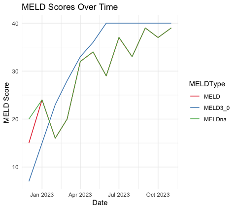

<!-- README.md is generated from README.Rmd. Please edit that file -->

# LivTransplantEvolution

<!-- badges: start -->
<!-- badges: end -->

## Description

The goal of `LivTransplantEvolution` is to an relevant biomarkers,
specifically those used in the MELD, MELD-na and MELD-3.0 risk score
calculations. It visualizes trajectories of those risk scores and
extracts the biomarkers most impactful of each longitudinal change.

- R Development Version: 4.1.2
- Development Platform: Mac

## Installation

You can install the development version of LivTransplantEvolution from
[GitHub](https://github.com/Mouaid-Alim/LivTransplantEvolution) with:

``` r
install.packages("devtools")
library("devtools")
devtools::install_github("Mouaid-Alim/LivTransplantEvolution", build_vignettes = TRUE)
library("LivTransplantEvolution")
```

## Overview

``` r
ls("package:LivTransplantEvolution")
data(package = "LivTransplantEvolution") # optional
browseVignettes("LivTransplantEvolution")
```

`LivTransplantEvolution` contains 6 functions. *prepareData* Prepares
and cleans up raw clinical serum blood test result results for a single
patient to extract Liver transplantation relevant clinical serum
biomarkers, specifically those used in the MELD score calculations.
*calcMELD* Will calculate the MELD score for a patient *calcMELDna* Will
calulcate the MELD-na score for a patient *calcMELDthree* Will calculate
the MELD-3.0 score for a patient *createMELDdf* Will create a dataframe
from the cleaned up data to contain longitudinal MELD scores values at
each timepoint *visualizeMELD* Creates a visual with all 3 MELD score
evolutions together.

Package visual result: 

## Contributions

This Package is Created by Mouaid Alim

## Refernces

Bibliography

1.  Potosek, J., Curry, M., Buss, M. & Chittenden, E. Integration of
    palliative care in end-stage liver disease and liver
    transplantation. J. Palliat. Med. 17, 1271–1277 (2014).
2.  Summary statistics on organ transplants, wait-lists and donors.
    Cihi.ca
    <https://www.cihi.ca/en/summary-statistics-on-organ-transplants-wait-lists-and-donors>.
3.  Kwong, A. J. et al. OPTN/SRTR 2019 annual data report: Liver. Am. J.
    Transplant 21 Suppl 2, 208–315 (2021).
4.  Kamath, P. et al. A model to predict survival in patients with
    end-stage liver disease. Gastroenterology 120, A76–A77 (2001).
5.  Biggins, S. W. et al. Serum sodium predicts mortality in patients
    listed for liver transplantation. Hepatology 41, 32–39 (2005).
6.  Kim, W. R. et al. MELD 3.0: The model for end-Stage Liver Disease
    updated for the modern era. Gastroenterology 161, 1887-1895.e4
    (2021).
7.  Liver transplant risk stratification. R-project.org
    <https://cran.r-project.org/web/packages/transplantr/vignettes/liver_recipient_scoring.html>.
8.  UCI Machine Learning. Indian Liver Patient Records. (2017).

## Acknowledgements

This package was developed as part of an assessment for 2023 BCB410H:
Applied Bioinformatics course at the University of Toronto, Toronto,
CANADA. LivTransplantEvolution welcomes issues, enhancement requests,
and other contributions. To submit an issue, use the GitHub issues.
