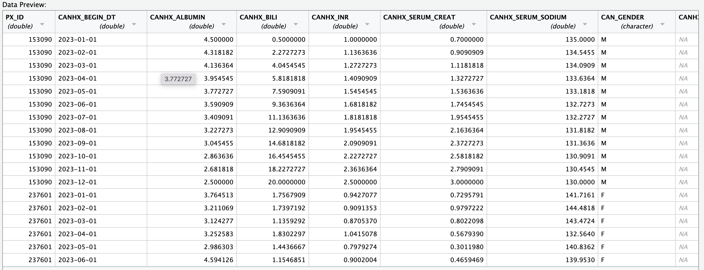
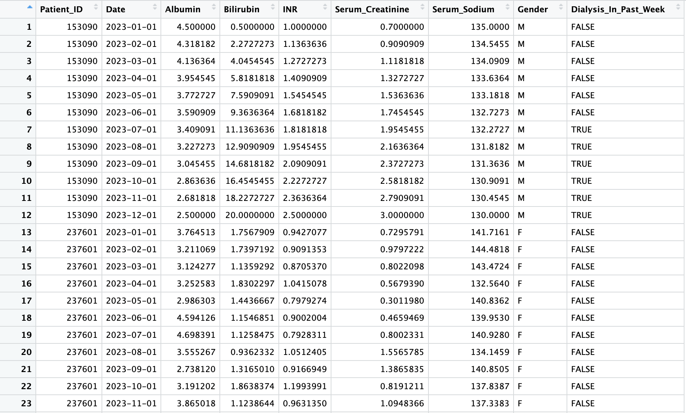

```{r, include = FALSE}
knitr::opts_chunk$set(
  collapse = TRUE,
  comment = "#>"
)
```

```{r, eval=FALSE}
library(LivTransplantEvolution)
```

## Introduction

`LivTransplantEvolution` is an R package that analyzes patient data from the 
stathiist_liin data file found in the SRTR database, a databse containing patient
information for all patients put in the waitlist for an organ transplantation.
The package takes this data and calculates and visualizes the 
longitudinal trajectories for the Model for End-stage Liver Disease (MELD) risk 
scores. The risk scores it visualizes are the MELD, MELDna and MELD3.0 liver 
transplantation relevant risk scores. These risk scores are used to calculate 
the severity of liver dysfunction in patients with End-stage
Liver disease. For MELD and MELD-na the resulting score can be used to estimate
the 90 day chances of mortality for that patient, while the MELD-3.0 score tells
us the estimated 90 day chances of survival for that patient.
MELD and MELD-na re the currently used severity calculation models and are used
in the allocation of Decesased Donor Liver Organs. Thus an visualization of 
these MELD scores and their trajectories can inform clinicans a great deal about
the future patient state of the patient and if they are imporving or worsening.

The package was developed on `R version 4.3.2 (2023-10-31)` on a  macOS 
Monterey 12.0.1 operating system under the x86_64-apple-darwin20 (64-bit) 
platform

See `help(package = "LivTransplantEvolution")` for further details
To download **LivTransplantEvolution**, use the following commands:

```{r, eval=FALSE}
require("devtools")
devtools::install_github("Mouaid-Alim/LivTransplantEvolution", build_vignettes = TRUE)
library("LivTransplantEvolution")
```
To list all sample functions available in the package:
```{r, eval=FALSE}
ls("package:LivTransplantEvolution")
```

To list all sample datasets available in the package:
``` {r, eval=FALSE}
data(package = "LivTransplantEvolution")
```

## Workflow
In the following session, I will demonstrate extensively how to use the 
**LivTransplantEvolution** package for the visualization of the longitudinal
trajectories of the MELD, MELD-na and MELD3.0 risk scores. The workflow is as follows:
1. Run the *prepareData* function on the raw patient data csv file to create a dataframe containing the clenaup data and only the relevant data to calculate the different MELD scores 
2. Run the *createMELDdf* function on the cleaned up dataframe to create a dataframe containing the MELD, MELD-na and MELD-3.0 risk score values for every entry for every patient
3. Call the *visualizeMELD* function on the MELD dataframe created by the *createMELDdf* function and a valid patient_ID in order to visualize the longitudinal trajectories of the MELD, MELD-na and MELD-3.0 values for that patient

### Step1: Loading patient data csv file with same structure as SRTR database stathiist_liin data file
The first step before any analysis can happen is to take the raw patient data
found in stathiist_liin data file in the SRTR database and clean it up and 
convert it into a r dataframe for easy analysis. This dataframe will only have the relevant data to calculate the different MELD scores. To do this we use the 
*prepareData* function. 

This function takes in the raw patient data in a csv 
file format. The raw patient data needs to have the same structure for the 
stathiist_liin data file and it is necessary for it to have the following columns:
PX_ID (The patients ID for that entry),
CANHX_BEGIN_DT (date of that specific entry into the dataset), CANHX_ALBUMIN
(ALbumin data), CANHX_BILI (Bilirubin data), CANHX_INR (INR data),
CANHX_SERUM_CREAT (Creatinine data), CANHX_SERUM_SODIUM (Serum Sodium data)
and 'CANHX_DIAL_PRIOR_WEEK' (Has the patient had dialysis in the past week)
These columns are needed as it contains all the data needed to calculate the 
MELD, MELD-na and MELD-3.0 risk scores.

The *prepareData* function will take this raw data file and return a dataframe 
containing the following columns, where each column corresponds to the same data
in the stathiist_liin data file. Patient_ID, Date, Albumin, Bilirubin, INR, 
Serum_Creatinine, Serum_Sodium, Gender, Dialysis_In_Past_Week.

The first thing we do is get the path for the csv file containing the raw patient
data. I am going to use a sample file that I created that has the correct structure:

Here is what the columns and data in the raw patient data csv file would lool like
{width=80%}

```{r}
# Path to the sample CSV file
sample_file_path <- "../inst/extdata/updated_meld_patient_data.csv"
```

We will then call the *prepareData* function on this sample csv file

```{r}
library(LivTransplantEvolution)
# Call prepareData function on sample CSV file
cleanedUpData <- LivTransplantEvolution::prepareData(sample_file_path)
# Inspect the dataframe
head(cleanedUpData)
```

Here is what the output looks like. It will only contain the Patient_ID, Date, Albumin, Bilirubin, INR, Serum_Creatinine, Serum_Sodium, Gender and Dialysis_In_Past_Week columns:

{width=80%}

### Step2: Create dataframe containing the MELD, MELD-na and MELD-3.0 risk score values for every entry in the cleaned up patient dataframe

To do this we will have to take a dataframe with a valid sturcture. This should be a dataframe created by the *prepareData* function. The *createMELDdf* function will then calculate the MELD, MELD-na and MELD-3.0 risk score values for each one entry in the input dataframe and create a dataframe where each row corresponds to the MELD, MELD-na and MELD-3.0 risk score values for the entry with the same Patient_ID and Date in the input dataframe. 

The package contains a sample cleaned up dataset which we will use to demonstrate the *createMELDdf* function

```{r}
# load sample cleaned up patient data dataframe 
cleandUpSampleData <- LivTransplantEvolution::cleanedUpSamplePatientData

# Call createMELD function on sample dataframe
MELDdf <- LivTransplantEvolution::createMELDdf(cleandUpSampleData)

# Inspect the the MELD dataframe created
head(MELDdf)
```

To calculate the MELD, MELD-na and MELD-3.0, *createMELDdf* uses the *calcMELD*, *calcMELDna* and *calcMELDThree* functions respectively. 
*calcMELD* takes in DialysisTwoTimesWeek (a boolean value indicating whether the patient has had dialysis in the past two weeks), Creatinine (A numeric value for the creatinine biomarker which informs the kidney dysfunction associated with the liver dysfunction, Bilirubin (a numeric value for the bilirubin biomarker that measures the ability of the liver to process byproducts from the breakdown of old red blood cells. Elevated levels in the blood (hyperbilirubinemia) indicate poor liver function), INR (a numeric value for a biomarker that tells us how fast or slow clotting is happeneing which can inform us about liver injury). 
*calcMELDna* uses the same inputs as calcMELD, but it also takes in the sodium (a numeric value also indicative of kidney function). 
*calcMELDThree* uses Creatinine, Bilirubin, INR and sodium, but it also takes into account the Sex of the patient and Albumin value (a numeric value for the albumin biomarker. Albumin is a liver synthesized protein which low levels of can indicate chronic liver disease or liver dysfunction)

A demo of how these functions can be used to calculate their respective risk scores can be seen below:

```{r}
# calculate the MELD risk score for some values
meldScore <- LivTransplantEvolution::calcMELD(dialysisTwoTimeWeek = "FALSE", 
                                              creatinine = 2.3, bilirubin = 3.1,
                                              inr = 1.9)

# calculate the MELD-na risk score
meldnaScore <- LivTransplantEvolution::calcMELDna(dialysisTwoTimeWeek = "TRUE", 
                                                  creatinine = 1.2, 
                                                  bilirubin = 3.1, inr = 1.9, 
                                                  sodium = 145)

# calculate the MELD-3.0 risk score
meldthreeScore <- LivTransplantEvolution::calcMELDThree(sex = "F", 
                                                        creatinine = 1.2, 
                                                        bilirubin = 3.1, 
                                                        inr = 1.9, sodium = 145,
                                                        albumin = 4)
```

### Step3: Plot the longitudinal trajectory of the MELD, MELD-na and MELD-3.0 risk scores for a valid patient by running the visualizeMELD function on MELD dataframe and a valid patient ID

The last step in this workflow is to visualize the longitudinal trajectory of the MELD, MELD-na and MELD-3.0 risk scores for the patients. This is done by calling the *visualizeMELD* function on a valid MELD dataframe generated by the *createMELDdf* function and a valid patient ID. What the function will do is create a ggplot2 ling graph for the trajectory of the MELD scores for the patient whose ID was provided as input.

We can view this by using the *sampleMELDdf* which is a sample data frame that is an ideal input to the *visualizeMELD* function.

```{r}
# load sample MELD dataframe
sampleMELDDataFrame <- LivTransplantEvolution::sampleMELDdf

# visualize the MELD score trajectories for the given patient with patient_id
visualizeMELD(meldScoresdf = sampleMELDDataFrame, patient_id = 153090)

```

### Refernces

1.
Potosek, J., Curry, M., Buss, M. & Chittenden, E. Integration of palliative care
in end-stage liver disease and liver transplantation.
*J. Palliat. Med.* 17, 1271–1277 (2014).
2.
Summary statistics on organ transplants, wait-lists and donors. Cihi.ca https://www.cihi.ca/en/summary-statistics-on-organ-transplants-wait-lists-and-donors.
3.
Kwong, A. J. et al. OPTN/SRTR 2019 annual data report: Liver. *Am. J. Transplant*
    21 Suppl 2, 208–315 (2021).
4.
Liver transplant risk stratification. R-project.org         https://cran.r-project.org/web/packages/transplantr/vignettes/liver_recipient_scoring.html.
5.
The SRTR database.
    Srtr.org https://www.srtr.org/about-the-data/the-srtr-database/.
6.
Kamath, P. et al. A model to predict survival in patients with end-stage
    liver disease. *Gastroenterology* 120, A76–A77 (2001).
7.
Kim, W. R. et al. MELD 3.0: The model for end-Stage Liver Disease updated for
     the modern era. *Gastroenterology* 161, 1887-1895.e4 (2021).
8.
Slack, A., Yeoman, A. & Wendon, J. Renal dysfunction in chronic liver
    disease. *Crit. Care* 14, 214 (2010).
10.
Biggins, S. W. et al. Serum sodium predicts mortality in patients listed for
    liver transplantation. *Hepatology* 41, 32–39 (2005).
11.
Guerra Ruiz, A. R. et al. Measurement and clinical usefulness of bilirubin in
     liver disease. *Adv. Lab. Med.* 2, 352–361 (2021).
12.
Kalas, M. A., Chavez, L., Leon, M., Taweesedt, P. T. & Surani, S. Abnormal
    liver enzymes: A review for clinicians. *World J. Hepatol.*
    13, 1688–1698 (2021).
13.
Tufoni, M., Zaccherini, G., Caraceni, P. & Bernardi, M. Albumin: Indications
    in chronic liver disease. *United European Gastroenterol. J.*
    8, 528–535 (2020).
14.
Wickham H, François R, Henry L, Müller K, Vaughan D (2023).
    *dplyr: A Grammar of Data Manipulation.* R package version 1.1.4,
    https://github.com/tidyverse/dplyr, https://dplyr.tidyverse.org.
15.
Wickham H, Henry L (2023). *purrr: Functional Programming Tools.*
    R package version 1.0.2,
    https://github.com/tidyverse/purrr, https://purrr.tidyverse.org/.
16.
Wickham H, Hester J, Chang W, Bryan J (2022).
    *devtools: Tools to Make Developing R Packages Easier.*
    https://devtools.r-lib.org/, https://github.com/r-lib/devtools.
17.
Wickham H, Vaughan D, Girlich M (2023). *tidyr: Tidy Messy Data.*
    R package version 1.3.0,
    https://github.com/tidyverse/tidyr, https://tidyr.tidyverse.org.
18.
Wickham H (2016). *ggplot2: Elegant Graphics for Data Analysis.*
    Springer-Verlag New York. ISBN 978-3-319-24277-4,
    https://ggplot2.tidyverse.org.
19.
Silva, A. (2022) TestingPackage: An Example R Package For BCB410H.
    Unpublished. URL https://github.com/anjalisilva/TestingPackage."

```{r}
sessionInfo()
```

